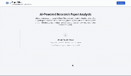

# PaperWise 🤖📚

**AI-Powered Research Paper Analysis for PhD Students and Researchers**

PaperWise is an intelligent AI agent system that provides deep, critical analysis of research papers, going beyond simple summarization to offer the kind of insights that PhD students and Principal Investigators need for their research.

[](https://python.org)
[](https://reactjs.org)
[](https://typescriptlang.org)
[](https://fastapi.tiangolo.com)
[](LICENSE)

## ✨ Features

- **🔍 Deep Analysis**: Critical evaluation of methodology, results, and implications using parallelized LangGraph agents.
- **☁️ Managed RAG**: High-performance document understanding powered by LlamaCloud.
- **📄 Agentic Parsing**: Superior PDF extraction with LlamaParse (Tables, Figures, OCR).
- **🤖 Parallel Multi-Agent System**: Specialized AI nodes working collaboratively for 3x faster analysis.
- **📊 Research-Focused**: Designed specifically for PhD students and PIs.
- **💬 Knowledge Chat**: Interactive deep-dive chat with persistent memory and verified citations.

## 🎯 What PaperWise Analyzes

PaperWise helps researchers understand:

- **The "What" and "Why"**: Problem statements, hypotheses, and motivations
- **The "How"**: Methodology, experimental design, and novelty
- **The "Results and Impact"**: Key findings, interpretations, and limitations
- **The "So What"**: Contribution to the field and relevance to your work

## 🎥 Demo

<div align="center">
  
  <br/>
  <em>🚀 Watch PaperWise in action - From upload to comprehensive analysis in seconds</em>
</div>

## 🏗️ Architecture

### AI Agents & Orchestration
- **LangGraph**: Directed Acyclic Graph orchestrator for complex, parallel analysis workflows.
- **LlamaIndex/LlamaCloud**: Managed retrieval-augmented generation (RAG) for expert document chat.
- **LlamaParse**: High-fidelity document parsing for high-fidelity technical extraction.
- **Google Gemini 2.5 Flash**: SOTA multimodal intelligence for deep research reasoning.

### Backend
- **FastAPI**: High-performance REST API with streaming support.
- **Celery & Redis**: Robust asynchronous task processing for long-running analyses.
- **PyMuPDF**: Secondary parsing and image asset extraction.

### Frontend
- **React 18** with TypeScript.
- **Tailwind CSS** for modern research UI.
- **Real-time Streaming**: SSE for live agent status and progress updates.

## 🚀 Quick Start

### Prerequisites
- Python 3.8+
- Node.js 16+
- [Gemini API key](https://aistudio.google.com/app/apikey)

### 1. Clone and Setup
```bash
git clone <repository-url>
cd PaperWise
```

### 2. Set Environment Variable
```bash
export GEMINI_API_KEY='your-gemini-api-key-here'
```

### 3. Run the Application
```bash
# Start both backend and frontend
./start-paperwise.sh

# Or start individually:
# Backend
cd backend
python -m venv venv
source venv/bin/activate  # On Windows: venv\Scripts\activate
pip install -r requirements.txt
python -m uvicorn app.main:app --reload --host 0.0.0.0 --port 8000

# Frontend (in new terminal)
cd frontend
npm install
npm start
```

### 4. Open Your Browser
Navigate to [http://localhost:3000](http://localhost:3000) (or [http://localhost:3002](http://localhost:3002) if using Docker)

## 🐳 Docker Development

For a "Live Coding" experience where changes are detected automatically (Hot-Reloading):

```bash
./dev.sh
```

This script is a shortcut for:
```bash
docker compose -f docker-compose.yml -f docker-compose.dev.yml up -d --build
```

It will:
- Map your local `backend/` and `frontend/` folders into the containers.
- Enable `uvicorn --reload` for the backend.
- Enable `npm start` (HMR) for the frontend.
- Use polling to ensure file changes are detected across all operating systems.
- Expose the frontend at [http://localhost:3002](http://localhost:3002) and backend at [http://localhost:8081](http://localhost:8081).

## 🛠️ Tech Stack

| Component | Technology | Version |
|-----------|------------|---------|
| **Frontend** | React, TypeScript, Tailwind CSS | 18.2.0 |
| **Backend** | FastAPI, Python | 0.104+ |
| **AI/ML** | Google Gemini, LangChain | Latest |
| **Document Processing** | PyMuPDF, LangChain | Latest |
| **Package Management** | uv (Python), npm | Latest |
| **Deployment** | Docker | Ready |

## 📖 Usage

1. **Upload a PDF**: Drag and drop or click to upload a research paper
2. **Optional Query**: Add specific questions about the paper
3. **Analyze**: Click "Analyze Paper" to start the AI analysis
4. **Review Results**: View comprehensive analysis including:
   - Executive summary
   - Key insights
   - Detailed analysis
   - Recommendations for different stakeholders

## 🔧 Configuration

### Environment Variables

| Variable | Description | Default |
|----------|-------------|---------|
| `GEMINI_API_KEY | Your Gemini API key | **Required** |
| `GEMINI_BASE_URL | Gemini base URL | `https://generativelanguage.googleapis.com/v1beta/openai/` |
| `GEMINI_MODEL | Gemini model to use | `gemini-2.5-flash` |
| `GEMINI_TEMPERATURE | Model temperature | `0.1` |
| `UPLOAD_DIR` | File upload directory | `uploads` |
| `MAX_FILE_SIZE` | Maximum file size | `50MB` |
| `CHUNK_SIZE` | Text chunk size | `1000` |
| `CHUNK_OVERLAP` | Chunk overlap size | `200` |

## 📚 Documentation

For detailed setup instructions, API documentation, and development guides, see the [Documentation](docs/README.md).

## 🤝 Contributing

We welcome contributions! Please see our [Contributing Guidelines](CONTRIBUTING.md) for details.

1. Fork the repository
2. Create a feature branch (`git checkout -b feature/amazing-feature`)
3. Commit your changes (`git commit -m 'Add amazing feature'`)
4. Push to the branch (`git push origin feature/amazing-feature`)
5. Open a Pull Request

## 🐛 Troubleshooting

### Common Issues

- **PDF Parsing Errors**: Ensure PDF is not password-protected or corrupted
- **API Key Issues**: Verify Gemini API key is valid and has sufficient credits
- **Memory Issues**: Reduce chunk size for large documents
- **Timeout Errors**: Increase timeout settings for complex analyses

### Getting Help

- Check the [Documentation](docs/README.md)
- Review [Troubleshooting Guide](docs/README.md#troubleshooting)
- Open an [Issue](../../issues) for bugs or feature requests

## 📄 License

This project is licensed under the MIT License - see the [LICENSE](LICENSE) file for details.

## 🙏 Acknowledgments

- Built with [Google Gemini](https://ai.google.dev/) models
- Powered by [LangChain](https://langchain.com/) for AI orchestration
- UI components from [Lucide React](https://lucide.dev/)

---

<div align="center">
  <strong>Made with ❤️ for the research community</strong>
</div>