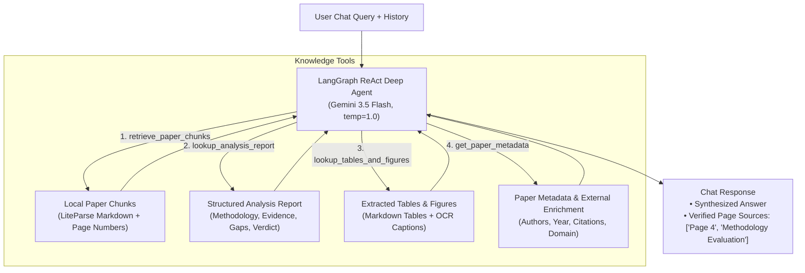

# Knowledge Chatbot Architecture: LangGraph Deep Agent Design

> **Status**: Implemented & Verified ✅  
> **Branch**: `feature/langgraph-deep-agent-chat`  
> **Default LLM**: `gemini-3.5-flash` (`temperature: 1.0`)  
> **Target**: Replace deprecated LlamaCloud Managed RAG with a Self-Contained LangGraph Deep Agent  
> **Affects**: [`knowledge_chat_agent.py`](file:///Users/nathanielislas/CursorProjects/PaperWise/backend/app/agents/knowledge_chat_agent.py), [`chat.py`](file:///Users/nathanielislas/CursorProjects/PaperWise/backend/app/routers/chat.py), [`worker.py`](file:///Users/nathanielislas/CursorProjects/PaperWise/backend/app/worker.py), [`analysis_manager.py`](file:///Users/nathanielislas/CursorProjects/PaperWise/backend/app/analysis_manager.py)

---

## 1. Executive Summary & Root Cause Analysis

### The Failure Observed
During background job processing and interactive chat testing, the server logged the following fatal error:

```text
Error in LlamaIndex KnowledgeChatAgent: status_code: 404, body: {'detail': 'Project `PaperWise` not found'}
llama_cloud.core.api_error.ApiError: status_code: 404, body: {'detail': 'Project `PaperWise` not found'}
INFO: 172.217.113.4:52852 - "POST /api/v1/analyses/{id}/chat HTTP/1.1" 500 Internal Server Error
```

### Why It Failed
1. **Hardcoded Cloud SaaS Dependency**: The legacy chat agent attempted to create or connect to a remote cloud project named `PaperWise` hosted on LlamaCloud (`llama_cloud_services.LlamaCloudIndex`). If the user's LlamaCloud account does not have a project called `PaperWise` pre-created, the LlamaCloud API rejects requests with HTTP 404.
2. **Redundant Remote Ingestion**: The Celery worker attempted to upload the paper to LlamaCloud (`await index.aupload_file()`) and block waiting for remote cloud ingestion (`await index.await_for_completion()`), even though PaperWise had **already** parsed the entire paper locally using LiteParse into high-fidelity Markdown, tables, and chunks.
3. **Deprecated Library**: The package `llama-cloud-services` is deprecated with scheduled sunset, generating `DeprecationWarning` on startup.
4. **Architectural Inconsistency**: While PaperWise's core analysis engine migrated to **LangGraph** with Google Gemini 3.5 Flash, the chat engine remained on a separate, brittle third-party cloud service.

---

## 2. Architectural Comparison: Options for the Knowledge Chatbot

We evaluated four potential architectures:

| Feature | Option 1: LangGraph Deep Agent (Selected & Implemented) | Option 2: LangChain Standard RAG | Option 3: LlamaIndex Local Index | Option 4: Full-Context Gemini Prompting |
|---|---|---|---|---|
| **Multi-Source Reasoning** | 🟢 **High**: Dynamically queries paper text, analysis report, tables, and metadata | 🟡 **Medium**: Retrieves generic vector chunks only | 🟡 **Medium**: Document vector search only | 🔴 **Low**: Dumps text into prompt without targeted tools |
| **Citation Precision** | 🟢 **High**: Tool calls return verified page numbers & section titles (`[Page X]`) | 🟡 **Medium**: Similarity scores from vector store | 🟡 **Medium**: Source nodes from index | 🔴 **Low**: Prone to hallucinating page numbers |
| **Cloud Independence** | 🟢 **100% Local**: No external cloud service needed | 🟢 **100% Local** | 🟢 **100% Local** | 🟢 **Local** |
| **Architectural Cohesion** | 🟢 **100% LangGraph/LangChain**: Same framework as pipeline | 🟡 **Partial**: LangChain chains | 🔴 **Split**: Retains LlamaIndex alongside LangGraph | 🟡 **Minimal**: Single LLM invocation |
| **Response Latency** | 🟢 **Fast**: Focused chunks + report sections (~1-2s) | 🟢 **Fast**: Single retrieval step (~1-2s) | 🟡 **Moderate**: Local vector query (~2-3s) | 🔴 **Slower**: Massive context processing (~3-5s) |
| **Implementation Complexity** | 🟢 **Low/Moderate**: Built with `create_react_agent` & tools | 🟢 **Low**: Standard `create_retrieval_chain` | 🟡 **Moderate**: Managing local vector indices | 🟢 **Very Low**: Basic prompt formatting |

### Why Option 1 (LangGraph Deep Agent) is the Winning Architecture
A research paper reader does not just ask simple keyword questions ("What is the learning rate?"). Users ask synthesis and critical questions:
- *"Did the peer debate find the baselines fair?"* (Needs the **Analysis Synthesis Report**, not just the paper text).
- *"What are the exact findings in Table 3 on page 7?"* (Needs **Table & Figure Tool**).
- *"Explain the proof in Section 4.2."* (Needs **Page & Section Chunk Retrieval**).
- *"Who wrote this and how many citations does it have?"* (Needs **Metadata & Enrichment Tool**).

A **LangGraph Deep Agent** equipped with specialized tools inspects the query, chooses the right knowledge source (or combines multiple sources), and synthesizes a precise answer with verified page citations.

---

## 3. Deep Agent Architecture & Toolset



### Specialized Tools Implemented

1. `retrieve_paper_chunks(query: str, page_number: Optional[int] = None) -> str`:
   - Searches the paper's extracted LiteParse chunks using fast keyword/token matching with optional page filtering.
   - Returns matching text snippets labeled with exact page numbers (e.g., `[Page 6] ...`).

2. `lookup_analysis_report(section: Optional[str] = None) -> str`:
   - Reads directly from `analyses/{analysis_id}/results/comprehensive.json`.
   - Sections supported: `executive_summary`, `methodological_evaluation`, `evidence_quality`, `gap_analysis`, `novelty_assessment`, `impact_assessment`, `critical_review`, `overall_verdict`.
   - Allows instant answers about reviewer critiques without searching raw paper text.

3. `lookup_tables_and_figures(query: str) -> str`:
   - Inspects the structured tables extracted by LiteParse and figure OCR text.
   - Formats tabular data in clean Markdown so the LLM can interpret numerical results directly.

4. `get_paper_metadata() -> str`:
   - Returns title, authors, publication date, domain classification, and external citation counts from Semantic Scholar / Exa.

---

## 4. Local Data Storage & Persistence Strategy

To enable the Knowledge Chatbot to work immediately after paper analysis finishes, LiteParse extracted artifacts are persisted directly into the analysis directory on disk:

```text
backend/uploads/analyses/{analysis_id}/
├── paper.pdf                     # Original PDF file
├── metadata.json                 # Paper metadata & analysis status
├── parsed_content.json           # NEW: Persisted LiteParse text, chunks, and tables
├── results/
│   └── comprehensive.json        # Structured synthesis report (LangGraph output)
├── figures/                      # Extracted high-res figure PNGs
└── annotations.json              # User highlights and notes
```

### Persistence Implementation
In [`analysis_manager.py`](file:///Users/nathanielislas/CursorProjects/PaperWise/backend/app/analysis_manager.py):
- `save_parsed_content(analysis_id, parsed_content)`: Writes chunks, markdown, tables, and figure info to `parsed_content.json`.
- `get_parsed_content(analysis_id)`: Reads `parsed_content.json`, with automatic fallback to on-the-fly parsing if the cached file is missing.

In [`orchestrator_agent.py`](file:///Users/nathanielislas/CursorProjects/PaperWise/backend/app/agents/orchestrator_agent.py), [`worker.py`](file:///Users/nathanielislas/CursorProjects/PaperWise/backend/app/worker.py), and [`routers/analysis.py`](file:///Users/nathanielislas/CursorProjects/PaperWise/backend/app/routers/analysis.py):
- `parsed_content` is automatically saved upon completion of analysis.
- The Celery worker no longer makes external cloud uploads or calls LlamaCloud.

---

## 5. API Contract & Frontend Compatibility

The frontend ([`AnalysisPage.tsx`](file:///Users/nathanielislas/CursorProjects/PaperWise/frontend/src/pages/AnalysisPage.tsx#L358)) connects seamlessly to the chat endpoint:

### Request: `POST /api/v1/analyses/{analysis_id}/chat`
```json
{
  "message": "What were the primary baselines used and are they fair?",
  "history": [
    {"role": "user", "content": "Hello"},
    {"role": "assistant", "content": "Hi! How can I help you explore this paper?"}
  ]
}
```

### Response: `200 OK`
```json
{
  "answer": "The authors evaluated their model against three primary baselines [Page 8]: ... However, the critical review notes that baseline B was trained on a smaller dataset [Results Scrutiny].",
  "sources": ["Page 8", "Page 11", "Results Scrutiny"]
}
```

### Interactive UI Highlights
Because sources return `"Page X"`, the frontend's existing citation chips automatically enable researchers to click a source badge and jump directly to that page in the embedded PDF viewer.

---

## 6. Implementation Status & Validation

| Phase | Description | Status |
|---|---|---|
| **Phase 1** | Local Artifact Persistence (`save_parsed_content`, `get_parsed_content`) | ✅ Completed |
| **Phase 2** | LangGraph ReAct Deep Agent (`knowledge_chat_agent.py`) with 4 tools | ✅ Completed |
| **Phase 3** | Celery Worker & Dependency Decoupling (removed `llama-cloud-services`) | ✅ Completed |
| **Phase 4** | Global Model & Temperature defaults (`gemini-3.5-flash`, `1.0`) | ✅ Completed |
| **Phase 5** | Automated Testing & Verification | ✅ All 25 tests passing |

### Automated Test Verification
Run from `backend/`:
```bash
pytest
# Results: 25 passed in 20.23s
```
Key tests verified:
- `tests/test_knowledge_chat.py::test_retrieve_paper_chunks`: Verified keyword and page-filtered chunk retrieval.
- `tests/test_knowledge_chat.py::test_lookup_analysis_report`: Verified structured synthesis report section extraction.
- `tests/test_knowledge_chat.py::test_lookup_tables_and_figures`: Verified table formatting and OCR caption inspection.
- `tests/test_knowledge_chat.py::test_get_paper_metadata`: Verified paper title, authors, and metric retrieval.
- `tests/test_chat.py::test_chat_endpoint_success`: Verified end-to-end API response contract with citations.
- `tests/test_chat.py::test_chat_endpoint_analysis_not_found`: Verified 404 response on missing analysis ID.
